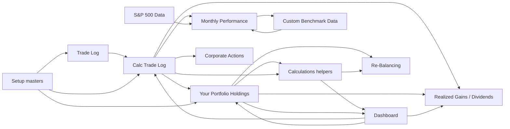

# Portfolio Core Migration Specification

## Status and evidence boundary

This is a specification only. It does not authorize or contain a database migration, application implementation, workbook modification, workbook conversion, staging, commit, or push.

The deterministic reference is `Investment Portfolio Tracker - TMOAP v8.9(3).xlsx`, inspected read-only on 2026-07-15. Source SHA-256 at inspection start: `190E3031C68A5BBFDA3BF98541B8A3C4A6C2115433C7CB7FC3555A4456FA2A00`.

All proposed Portfolio Core behavior is **unverified** until it is reconciled against fixed workbook snapshots. Formula values currently cached in the `.xlsx` are evidence for this snapshot; they are not permission to substitute a new market-data provider or infer a new accounting policy.

## 1. Workbook inventory

The workbook contains 16 visible worksheets, three Excel tables, 12 charts, no defined names, no hidden worksheets, no Power Query/connections, no Excel external-link parts, and no VBA project or macro parts. It is an `.xlsx` export of a Google Sheets-oriented tracker: formulas containing `GOOGLEFINANCE`, `IMPORTXML`, and `IMPORTRANGE` are retained as `__xludf.DUMMYFUNCTION` expressions with cached values. Those functions are not native executable Excel formulas.

| Sheet | Role | Formula cells | Inputs / controls / outputs |
| --- | --- | ---: | --- |
| Make a Copy | Blank copy placeholder | 0 | No data.
| Instructions | User guide and version/help links | 4 | Describes setup, trade entry, manual price override, monthly-script, and rebalance workflows.
| Setup | Master data | 754 | Five currencies, 25 categories, 10 accounts, 250 instrument slots; quote-in-cents flag; Google Finance symbol/name checks.
| Trade Log | User-entered transaction ledger | 4,004 | Table `Table_1` over `B6:J4005`; date, type, symbol, quantity, unit amount, total, fee, account, split ratio.
| Dashboard | As-of/filter selection and summary | 85 | Date mode, custom date, reporting currency, account filter, performance period, summary cards and five charts.
| Your Portfolio Holdings | Current/as-of holdings view | 17,789 | Per-instrument positions, ACB, prices, manual price overrides, FX, account breakdowns, price errors, split counts.
| Monthly Performance | Month-end history and benchmarks | 9,032 | Script-populated portfolio series, S&P 500 and custom benchmark comparison; five charts.
| Realized Gains | Average-cost-basis gains report | 5,734 | Start date; account-filtered account/category/ticker gain rollups.
| Dividends | Dividend history and yield estimates | 6,403 | Historical dividend reports and Yahoo Finance estimate with manual annual-dividend override; two charts.
| Re-Balancing | Target-allocation trade suggestion | 467 | Contribution/withdrawal, sells allowed, category targets, selected ticker, estimated shares.
| Corporate Actions | Spin-off transaction generator | 19 | Six inputs; produces three rows to paste as values into Trade Log.
| Change Log | Workbook release notes | 0 | Static release history.
| Calc Trade Log | Calculation ledger / transaction expansion | 160,002 | Table `Table_3` over `B6:J5005`, linked to Trade Log plus derived columns `L:AL` and further helper columns.
| Calculations | Helper schedules and report inputs | 59,903 | Account/category/holding ranking, FX, selected period, return calculation and dashboard helper areas.
| S&P 500 Data | Benchmark source cache | 2,087 | Cached `IMPORTRANGE` output for monthly S&P 500 total return.
| Custom Benchmark Data | Selected benchmark source cache | 8,824 | Cached daily Google Finance data transformed to month-end returns.

No sheet has `hidden` or `veryHidden` state. The presentation sheets hide helper columns: Holdings `F:O`, `AS:BY`, `BZ`, `CA:CG`; Realized Gains `Q:X`; Dividends `R:AC`; Re-Balancing `Q:Z`.

### Excel tables and names

| Object | Range | Interpretation |
| --- | --- | --- |
| `Table_1` | `Trade Log!B6:J4005` | Transaction-entry capacity. It has no formal table header row, so the visible headings at row 5 are the semantic schema.
| `Table_2` | `Corporate Actions!B24:I26` | Generated spin-off entries; copy/paste-as-values staging area, not an independent source ledger.
| `Table_3` | `Calc Trade Log!B6:J5005` | Linked/formula-expanded transaction grid; semantic columns continue through helper columns beyond the formal table range.
| Defined names | None | No workbook- or sheet-scoped named ranges were found.

## 2. Inputs, validation rules, and calculated surfaces

### Authoritative user-maintained inputs

| Workbook location | Proposed input meaning | Validation / capacity |
| --- | --- | --- |
| `Setup!B5:B9` | Reporting/holding currencies | Five slots; values drive currency dropdowns and FX logic.
| `Setup!B12:B36` | Investment categories | 25 slots.
| `Setup!B39:B48` | Investment accounts | 10 slots.
| `Setup!B52:D301`, `H52:H301` | Instrument symbol, native currency, category, price-in-cents flag | Currency/category list validation; cents flag is `Y`/`N`; duplicate symbol warning in `B52:B301`.
| `Trade Log!B6:J4005` | Transaction rows | Date validation; type list; allowed symbols/accounts; non-negative quantity, unit amount, fee, and split ratio.
| `Dashboard!C2:C4`, `E2`, `C53:C54` | As-of mode, reporting currency, account filter, custom as-of date, return period | `C2` is `Today`/`Custom`; account filter is derived from the helper account list; dates are validated.
| `Your Portfolio Holdings!H7,H9:H259` | Manual current market value override | Non-negative. Used when a provider quote is zero/unavailable.
| `Your Portfolio Holdings!AF7,AF9:AF259` | Manual performance-start market price | Non-negative.
| `Your Portfolio Holdings!AL7,AL9:AL259` | Manual performance-end market price | Non-negative.
| `Monthly Performance!D99` | Custom benchmark symbol | Google Finance name/valid-symbol checks at `D100:D101`.
| `Realized Gains!D3` | Realized-gain report start date | End defaults to `TODAY()` in `D4`.
| `Dividends!I125:I374` | Annual dividend-per-share manual override | Used when Yahoo Finance scraping is missing/incorrect.
| `Re-Balancing!F4:F5,F9:F36,J12:J36` | Contribution/withdrawal, sells policy, target allocation, preferred trade ticker | `F5` is `Yes`/`No`; allocations are non-negative and total is visibly checked.
| `Corporate Actions!C14:C19` | Spin-off date, parent, child, share ratio, cost-base ratio, account | Parent and account lists are validated; generated rows are not authoritative until pasted into Trade Log.

The yellow fill described in the Instructions sheet is a user-interface cue, not a safe data-classification mechanism. Portfolio Core must classify input authority by field, not by cell color.

### Transaction type enumeration

`Trade Log!C6:C4005` permits:

- `Buy`
- `Sell`
- `Dividend`
- `Split`
- `Return of capital`
- `Reinvested capital gain distribution`
- `Cost Base Adj.`

`Calc Trade Log` validation omits `Cost Base Adj.` even though its formulas explicitly process it. Treat this as a source inconsistency requiring reconciliation, not as an excuse to drop the type.

### Calculated surfaces and formula dependencies

Key formula families, expressed as business rules rather than cell-copy instructions, are:

| Area | Workbook evidence | Deterministic rule to preserve and test |
| --- | --- | --- |
| Master lookup | `Calc Trade Log!L:M` | Resolve instrument currency and category from Setup by symbol.
| Account filter | `Calculations!C2270`, `C2272`; widely consumed | Use `*` for all accounts or one selected account; all holdings, gains, dividends, and performance calculations must use the same filter semantics.
| Quantity roll-forward | `Calc Trade Log!N:O`, `Your Portfolio Holdings!E` | Prior buys less prior sells, including same-date rows in physical row sequence; apply split-adjusted share quantities and zero-out values whose absolute residual is below `1e-8`.
| Average cost base (ACB) | `Calc Trade Log!P:T` | Buy adds gross amount plus fee; sell removes adjusted quantity multiplied by pre-transaction ACB/share; return of capital reduces ACB; reinvested distribution and cost-base adjustment increase ACB; split changes quantity, not ACB.
| Realized gain | `Calc Trade Log!U:X` | For sells, local proceeds = gross less fee; local gain = net proceeds less ACB released. Convert both proceeds and cost basis using the workbook's trade-date FX path for common-currency gain.
| Split normalization | `Calc Trade Log!Z:AG` | For each relevant reporting date, multiply later split ratios for the same symbol after the source row and through the reporting date; use the resulting adjusted quantity for balances and ACB calculations.
| Historical/spot FX | `Calc Trade Log!AI:AL`; `Calculations!C331:G335` | Generate `Currency:{native}{reporting}` code; use same-currency rate 1; otherwise seek trade/as-of date then earlier dates (up to four days in observed quote formulas), then provider/current fallback, then 1. The exact fallback policy must be reconciled before implementation.
| Holdings valuation | `Your Portfolio Holdings!B:CD` | Calculate position quantity, last ACB, provider price, manual fallback price/value, FX conversion, unrealized gain/$/%, dividends, holding weight, per-account quantity/value, latest transaction date, and quote/split flags as of selected date.
| Price-in-cents conversion | `Setup!H52:H301`, Holdings price formulas | Divide provider quote by 100 for marked instruments before valuation; do not apply this to user-entered price/value unless reconciliation proves it is intended.
| Portfolio aggregates | `Holdings!U8:V8`, `Calculations!B5:B7` | Sum common-currency cost basis, market value, unrealized change, dividends, account/category/holding rankings and allocations.
| Time-period performance | `Dashboard!C53:C54`, `Calculations!B2231:E2220` | Compute starting value, buys, sells, return and dividends for a selected interval; display non-annualized return for periods under one year and annualized result otherwise.
| Category return | `Dashboard!B80:C108` | Calculate money-weighted return including dividends for each category and the total portfolio under the selected period/filter.
| Monthly performance | `Monthly Performance!J:Y` | Build month-end sequence, starting/ending portfolio value, cash contributions/withdrawals, investment return, dividend total, money-weighted return, and indexed portfolio/benchmark series.
| Benchmark comparison | `S&P 500 Data`, `Custom Benchmark Data`, `Monthly Performance!V:Y` | Match month-end dates to imported S&P 500 total returns and custom-benchmark monthly returns, then compound indexed series.
| Dividends/yield | `Dividends!B6:E`, `B16:E`, `B121:Y` | Aggregate dividend transactions by year/month/account/category/currency; estimate annual dividend/share from Yahoo Finance, then prefer manual override and calculate local/common-currency annual dividend and yield on cost/market value.
| Rebalancing | `Re-Balancing!B:Z` | Calculate category gap against target after contribution/withdrawal; if selling is disabled use positive gaps only and apportion available contribution among underweight categories; derive buy/sell, ticker price, and estimated shares.
| Spin-off generator | `Corporate Actions!B24:I26` | Determine parent shares and pre-spin-off ACB; generate child `Buy` with ratio quantity, child `Cost Base Adj.` for allocated cost, and parent `Cost Base Adj.` for equal opposite cost.

## 3. Proposed Portfolio Core data model

This is a proposed target model, not a migration DDL.

| Proposed entity | Essential fields | Workbook mapping / rationale |
| --- | --- | --- |
| Portfolio | id, name, base_currency, timezone, owner | The workbook operates as one portfolio; make the boundary explicit before multi-portfolio support.
| Account | id, portfolio_id, name, active, display_order | `Setup!B39:B48`; ordering is displayed and used in account charts.
| Currency | code, symbol, minor_unit, active | `Setup!B5:B9` plus Dashboard symbol rendering. Do not hardcode only the current five currencies.
| InvestmentCategory | id, portfolio_id, name, display_order, active | `Setup!B12:B36`; category is a portfolio classification, not intrinsic global instrument metadata.
| Instrument | id, canonical_symbol, provider_symbol, display_name, native_currency, quote_in_minor_units, active | `Setup!B52:H301`; preserve both entered/provider symbols and cents/pence flag.
| InstrumentCategoryAssignment | instrument_id, category_id, effective_from, effective_to | The workbook has one current category. Effective dating prevents retrospective reclassification from silently changing history.
| PriceQuote | instrument_id, quote_date_time, price, currency, source, fetched_at, quality/status | Google Finance price cells and manual overrides must be distinct sources and retain as-of provenance.
| FxRate | base_currency, quote_currency, rate_date, rate, source, status | `Calc Trade Log!AI:AJ` and Holdings conversion grids; retain exact date and fallback provenance.
| PortfolioTransaction | id, portfolio_id, account_id, instrument_id, trade_date, sequence, type, quantity, unit_price, gross_amount, fee_amount, currency, split_ratio, source_row, import_batch_id | Canonical immutable transaction/event record. `sequence` is required because same-date formulas are row-order sensitive.
| TransactionCostBasisAdjustment | transaction_id, amount, reason | Models `Return of capital`, `Reinvested capital gain distribution`, and `Cost Base Adj.` explicitly instead of hiding them in generic trade fields.
| CorporateAction | id, action_type, effective_date, parent_instrument_id, child_instrument_id, ratio, allocated_cost_ratio, source | The worksheet supports a spin-off helper; splits are also actions, even when represented as transaction rows for compatibility.
| DividendDeclaration/Estimate | instrument_id, annual_dividend_per_share, currency, source, as_of, manually_overridden | `Dividends!H:I,W` is an estimate surface, separate from received dividend transactions.
| BenchmarkSeries / BenchmarkObservation | benchmark_id, provider_symbol, total_return_flag, observation_date, value/return, source | S&P 500 and one selected custom benchmark are currently cached/imported series.
| ValuationSnapshot | portfolio/account/filter/as_of/base_currency, calculation_version, inputs_hash | Materialized/calculated view for holdings and dashboard reconciliation; not a hand-maintained source table.
| PositionSnapshot | valuation_snapshot_id, account_id, instrument_id, quantity, ACB, market_value, gains, FX/price references | Replaces `Your Portfolio Holdings` calculated grid while preserving auditability.
| RebalancePlan / RebalanceTarget | id, as_of, funding_amount, allow_sells, category target, proposed trades | Rebalance recommendations must not create trades until explicitly accepted and posted.
| WorkbookImportAudit | source_hash, source_sheet, source_row, parsed_payload, canonical_entity_id, result/status | Makes every imported value traceable to its original workbook row/cell and allows repeatable reconciliation.

### Event model requirements

1. Retain the raw imported row values before normalizing them. In particular, retain both unit price, gross amount, fee, split ratio, and source row even if an imported formula also derives one from another.
2. Represent every mutation as an immutable event. Correcting an input must create a reversal/amendment policy, not silently rewrite a historic event.
3. Treat trading currency, instrument native currency, and reporting/base currency independently.
4. Store money in decimal fixed precision and quantity at sufficient fractional precision; never rely on binary floating-point equality. The workbook visibly rounds holdings quantity to eight decimals and suppresses residuals under `1e-8`.
5. Make average cost basis an explicit calculation-policy version. It is the workbook policy and must be the first migration policy; FIFO/specific-lot support is future scope, not an implicit substitution.

## 4. Workbook-to-OpenStock concept mapping

| Workbook concept | OpenStock target | Migration treatment |
| --- | --- | --- |
| Setup lists | Reference/master records | Import in display order; preserve blank capacity as no record, not empty entities.
| Symbol master row | Instrument plus category assignment | Deduplicate only after a reviewed symbol identity map; do not assume ticker uniqueness across exchanges.
| Trade Log row | PortfolioTransaction plus optional cost-basis/action record | Preserve source row sequence and all nine user-facing fields.
| Calc Trade Log row | Derived transaction ledger / audit result | Recompute from canonical events; do not import it as a second source of transactions.
| Manual price cells | PriceQuote with source `manual_override` and effective as-of date | Preserve separately from provider quote and require user-entered provenance.
| Google Finance quote | PriceQuote / FxRate source candidate | Cached workbook result is a fixture; provider replacement is a separate approved decision.
| S&P 500/custom tables | Benchmark observations | Import cached historical observations with source metadata; future refresh policy remains unresolved.
| Holdings sheet | PositionSnapshot and holdings read model | Recomputed per portfolio/account/filter/as-of date.
| Dashboard selections | Query parameters / user view preferences | Not portfolio accounting state; defaults can be stored per user.
| Monthly performance grid | PerformanceSnapshot series | Recalculate from frozen snapshots/cash flows; preserve script-generated historical results as expected outputs.
| Dividend annual estimate | DividendDeclaration/Estimate | Keep source and manual override priority; received dividends remain ledger events.
| Corporate Actions generated rows | CorporateAction plus derived postings | Import the actual pasted Trade Log rows; retain helper inputs only if independently recorded.
| Rebalancing worksheet | RebalancePlan/targets/recommendations | Generate a proposed plan; do not auto-post the suggestions.
| Change Log | Import/legacy documentation | Attach as source metadata only; it is not operational data.

## 5. Manual workflow catalogue

| Workflow | Current workbook procedure | Portfolio Core equivalent / control |
| --- | --- | --- |
| Configure masters | Populate yellow cells in Setup, then rely on dropdown lists | Admin-managed portfolio master data with validation, duplicate review, and explicit effective dates.
| Enter trade | One Trade Log row per buy/sell/split/dividend/ROC/reinvested gain/cost-base adjustment | Transaction form/import with type-specific required fields and immutable source sequence.
| Verify instrument | Google Finance name and validity cells turn warning if lookup fails | Instrument resolution workflow with provider search and manual confirmation; failed lookup must not mutate accounting state.
| Select reporting view | Choose Today/Custom, date, currency, and account filter in Dashboard | Saved/read-only query parameters applied consistently to all reports.
| Repair price data | Enter manual price/value in Holdings when Google Finance fails | Audited manual price quote override, with source, author, time, and effective date.
| Populate monthly history | Click the `GO!` button; original Sheets script cycles dates and records monthly outputs | Deterministic scheduled/on-demand snapshot job, idempotent and replayable. The workbook contains no VBA equivalent of this button logic.
| Review gains | Enter report start date; end defaults to today | Read-only period report with average-cost policy displayed.
| Repair dividend estimate | Review Yahoo result and enter manual annual dividend/share where needed | Manual estimate override with expiry/source and clear separation from actual distributions.
| Plan rebalance | Enter funding, sells policy and target allocations; select a ticker for each proposed category | Draft RebalancePlan that requires explicit trade creation/approval.
| Process spin-off | Fill six fields, copy three generated rows, paste values into Trade Log, add child ticker to Setup | Create/approve CorporateAction, generate immutable postings, then verify position/ACB effect.

## 6. Unresolved ambiguities and decisions required before implementation

1. **Gross amount semantics are inconsistent.** The Trade Log label says “Total Amount (before trading fees),” but source rows include both `quantity × unit price` and at least one formula adding the fee. Import must preserve raw values and resolve whether gross amount is authoritative or derived on a row-by-row reconciliation basis.
2. **Same-date ordering is accounting-significant.** Calc Trade Log includes previous rows on the same date in its running calculations. The workbook's row order, not a timestamp, establishes the order; establish a required `sequence` policy for imports and UI edits.
3. **Account selection semantics.** The calculation engine uses `*`/single account filtering in many `SUMIFS` formulas. Confirm whether portfolio-wide ACB is intentionally recomputed under the selected account filter, or whether account-level ACB should be permanently scoped even in aggregate views.
4. **Market/Fx data contract.** The source is Google Sheets functionality embedded as inert XLFN/dummy formulas and cached values. Select providers, permitted fallback windows, market-calendar behavior, quoting time, retry behavior, and retention before implementing live refresh.
5. **Manual price override precedence.** Holdings has three manual-entry areas (current/start/end). Confirm whether the overrides are per price or per total value and whether they apply before/after FX and cents conversion.
6. **Transaction type gap.** `Cost Base Adj.` is accepted by Trade Log and calculation formulas but omitted from Calc Trade Log data validation. Confirm the intended availability and user-facing name.
7. **Return-of-capital and reinvested-distribution cash-flow treatment.** ACB treatment is observable; their inclusion in performance contributions, withdrawals, and money-weighted cash flows needs fixture-level confirmation.
8. **Corporate-action scope.** The helper implements one spin-off pattern. Define policies for mergers, symbol changes, tender offers, return of capital, fractional shares, withholding taxes, and multiple corporate actions on a date.
9. **Instrument identity and aliases.** Entries such as `NASDAQ:KEEL` and `TSE:HXT` show exchange-qualified symbols, while other symbols do not. Define canonical ID, exchange/mic, provider aliases, delisting history, and collision handling.
10. **Dividend estimate source.** Yahoo Finance HTML scraping is described by the workbook itself as rough and buggy. Decide whether estimates are in scope for Portfolio Core and, if so, define a supported provider and override governance.
11. **Performance methodology.** The workbook labels selected-period and category results “money-weighted,” while monthly rows are generated by a script. Establish exact return formula, annualization threshold, cash-flow timing, and whether dividends are external cash flows or internal return for each report.
12. **Current snapshot date.** Cached values are dated in the workbook as of 2026-07-15 (with a selected performance end date of 2026-07-06). They must be treated as frozen fixtures, not current market data.

## 7. Phased implementation plan

### Phase 0 — Specification lock and fixture harvest

- Approve the unresolved policies above.
- Freeze one or more workbook copies by hash and create machine-readable extracts of Setup, Trade Log, manual overrides, benchmark caches, and key calculated outputs.
- Define source-of-truth rules: raw input vs calculated sheet vs cached external value.

### Phase 1 — Core masters and import contract

- Implement the proposed masters, import audit records, raw-row preservation, row sequencing, validation/error reporting, and a dry-run importer.
- Import Setup masters and Trade Log only; do not import Calc Trade Log as transactions.
- Produce an import exception queue for duplicate/unknown symbols, invalid account/category references, and inconsistent amount fields.

### Phase 2 — Ledger and ACB calculation engine

- Implement all seven transaction types, per-account/all-account filtering, split normalization, ACB roll-forward, realized gains, and cost-base adjustments.
- Calculate pure derived transaction rows and compare them to Calc Trade Log before building UI reports.

### Phase 3 — Prices, FX, and as-of holdings

- Implement frozen fixture sources first, then approved live providers behind an auditable quote/FX interface.
- Add manual price overrides, cents handling, holdings/position snapshots, account/category allocations, and quote-error states.

### Phase 4 — Reports and performance

- Build dashboard summaries, realized gains, dividend receipt reports, selected-period return, monthly snapshots, and benchmark indexing.
- Keep performance results flagged as unverified until every prescribed fixture passes.

### Phase 5 — Guided workflows

- Implement corporate-action posting, rebalance drafts, instrument verification, and dividend estimate overrides.
- Ensure recommendations and generated corporate-action postings require explicit user approval before they mutate the ledger.

### Phase 6 — Parallel reconciliation and cutover

- Run Portfolio Core and workbook snapshots in parallel at fixed dates/currencies/accounts.
- Resolve every material delta, document accepted legacy quirks, and obtain sign-off before any live cutover or retirement of workbook workflows.

## 8. Reconciliation acceptance criteria

No proposed calculation is accepted merely because it is economically plausible. For each frozen workbook fixture, Portfolio Core must meet all of the following:

1. **Source integrity:** source workbook hash is recorded; no workbook values or formulas were altered; import row counts match populated setup/transaction rows; every imported transaction carries source sheet and row provenance.
2. **Master-data tie-out:** currencies, categories, accounts, symbols, native currencies, categories, and cents flags match the populated Setup rows exactly, with blank capacity excluded.
3. **Transaction completeness:** all seven transaction types are imported; date, sequence, account, symbol, quantity, unit amount, gross amount, fee, and split ratio reconcile to raw inputs without transformation loss.
4. **Derived-ledger tie-out:** for representative and edge-case rows, pre/post quantity, pre/post ACB, ACB/share, cost-basis impact, net sale proceeds, realized gain, split multipliers, FX rate, common-currency amounts, and same-date ordering match Calc Trade Log.
5. **Position tie-out:** at each approved as-of date, each instrument/account position reconciles on quantity, ACB, provider/manual price source, market value, FX conversion, gain, dividend receipt, weight, and split/quote flags. Portfolio total equals sum of position totals within an agreed decimal tolerance.
6. **Filter and currency matrix:** run every fixture for all accounts and each populated reporting currency, plus at least one individual account and custom date. No report may mix account-filter semantics.
7. **Report tie-out:** Dashboard cards, account/category ranking, holdings chart data, realized-gain totals, dividend year/month totals, allocation totals, rebalancing suggestions, selected-period return, and performance-by-category values match workbook outputs at frozen inputs.
8. **Performance tie-out:** month-end start/end value, contributions, withdrawals, investment return, dividends, money-weighted return, and indexed portfolio/S&P/custom-benchmark series match the Monthly Performance grid for all populated months.
9. **Corporate-action fixture:** reproduce the workbook's spin-off example and at least one real imported split; generated/posted events must tie on child quantity and parent/child cost-base reallocation.
10. **Expected-error handling:** workbook `#DIV/0!` and `Error` outcomes (for example absent holdings or Yahoo dividend estimates) must be classified as expected states, not hidden as zero or silently accepted as valid data.
11. **Tolerance policy:** compare quantities and money using decimal values; define and publish field-specific rounding/tolerances. Differences larger than display rounding, or any sign/type/source mismatch, fail reconciliation.
12. **Auditability:** every accepted result can be traced from a Portfolio Core output through derived events and price/FX observations to original workbook input cells/rows and the frozen source hash.

